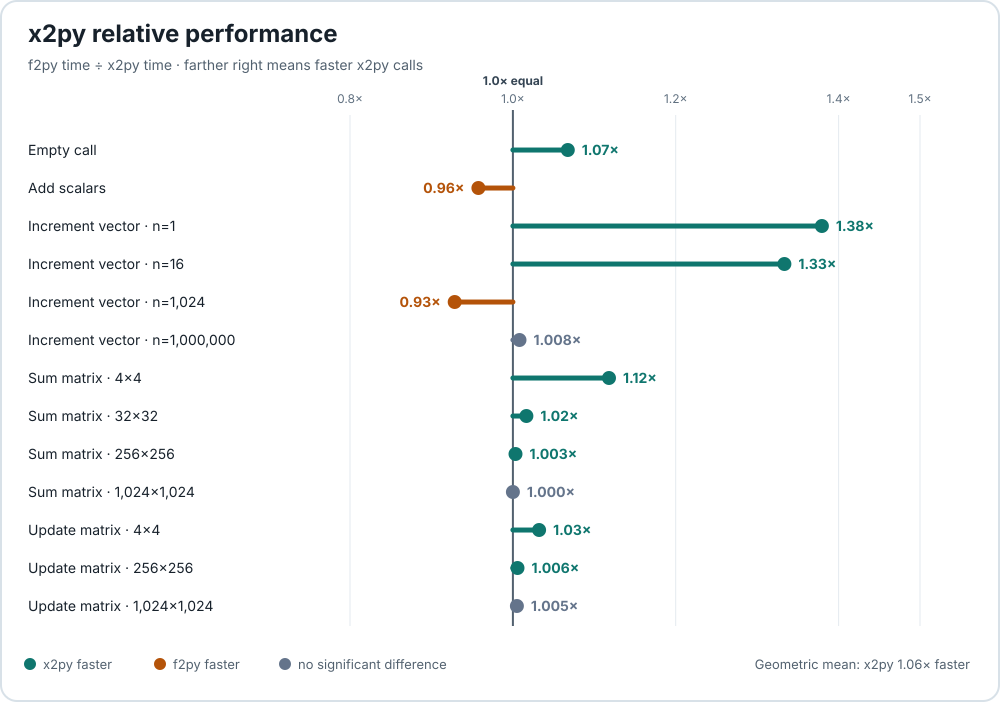
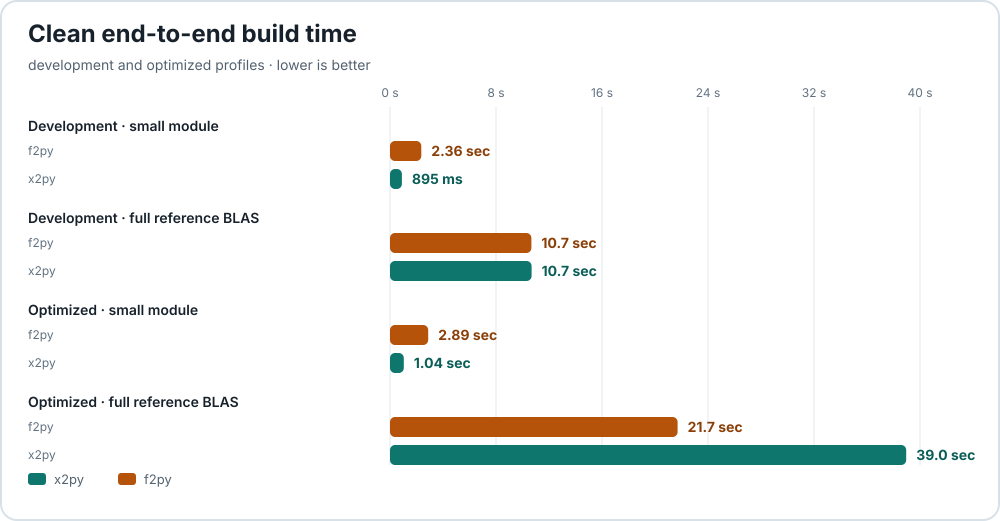

# x2py

**Turn Fortran into natural Python APIs.**

Build clean, importable native extensions from supported Fortran without
writing low-level binding code. x2py preserves modules, derived types, arrays,
and native behavior, and generates an editable `.pyi` contract so you can
shape the Python API.

The complete example below builds with one command:

```bash
python3 -m x2py points.f90 --out geometry
```

---

## See it in action

Create `points.f90`:

<!-- x2py-doc-source: tests/fortran/building_shared_library/end_to_end/fixtures/native/home_points.f90 -->
```fortran
module points
  implicit none

  type :: point
    real(8) :: x = 0.0d0
    real(8) :: y = 0.0d0
  end type point

contains

  subroutine move(item, dx, dy)
    type(point), intent(inout) :: item
    real(8), intent(in) :: dx, dy
    item%x = item%x + dx
    item%y = item%y + dy
  end subroutine move

  real(8) function norm_squared(item) result(value)
    type(point), intent(in) :: item
    value = item%x * item%x + item%y * item%y
  end function norm_squared

end module points
```

**Generated Python API:**

```python
import numpy as np
import geometry.points as points

item = points.point(x=np.float64(3.0), y=np.float64(4.0))
points.move(item, np.float64(1.0), np.float64(-2.0))

print(item.x, item.y)             # 4.0 2.0
print(points.norm_squared(item))  # 20.0
```

No manual bindings are required. From this source, x2py creates a Python
namespace, a class with accessible fields, a mutating procedure, and a
function.

Want a different Python API? Edit the generated `.pyi` contract to rename or
hide exports, flatten namespaces, define constructors and methods, or create
overloads. The [contract guide](user/reference/pyi-contracts/index.md) shows
the available edits.

---

## How it works

1. Write standard Fortran.
2. Run `x2py` on the source.
3. Import the generated native extension.
4. Optionally edit the generated `.pyi` contract to shape the Python API.

No manual binding code or low-level boilerplate.

---

## Key Features

- Fortran modules exposed as Python namespaces and derived types as classes
- NumPy arrays with explicit dtype, shape, and layout checks
- Allocatable and pointer arrays with explicit lifetime operations
- Immediate Python callbacks and overloaded interfaces
- Editable `.pyi` contracts and readable generated docstrings
- Early, clear errors when a boundary cannot be wrapped
- Low wrapper overhead measured against NumPy's
  [f2py](user/performance.md) in a reproducible benchmark suite

---

## Measured Performance

**Low wrapper overhead, measured against NumPy's f2py.**

The latest published benchmark runs both tools against the same Fortran
kernels through their normal generated interfaces. Results are
machine-dependent; the detailed page records the complete environment and
reproduction method.

**Runtime-call performance** — values above `1.0×` mean x2py is faster.

[](user/performance.md)
{ .x2py-performance-chart }

**Clean end-to-end build time** — lower times are better.

[](user/performance.md#clean-build-time)
{ .x2py-performance-chart }

[View the full results and methodology →](user/performance.md)

---

**Ready to wrap your Fortran code?**

[Getting Started Guide →](user/getting-started/index.md){ .x2py-primary-cta }
